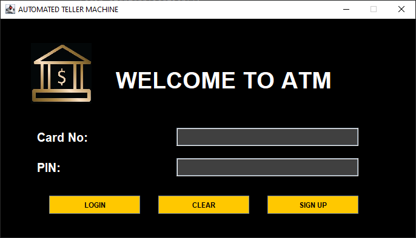
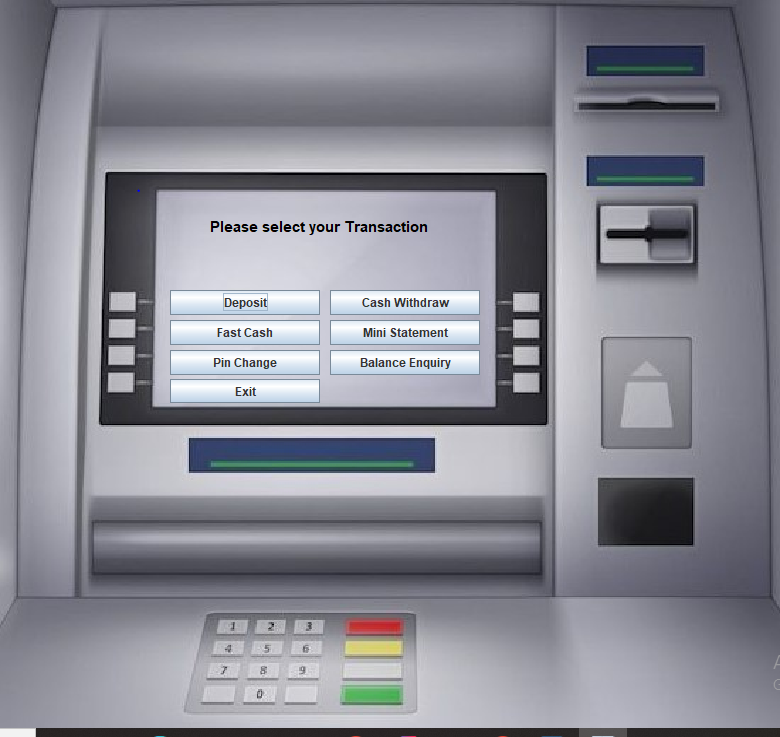
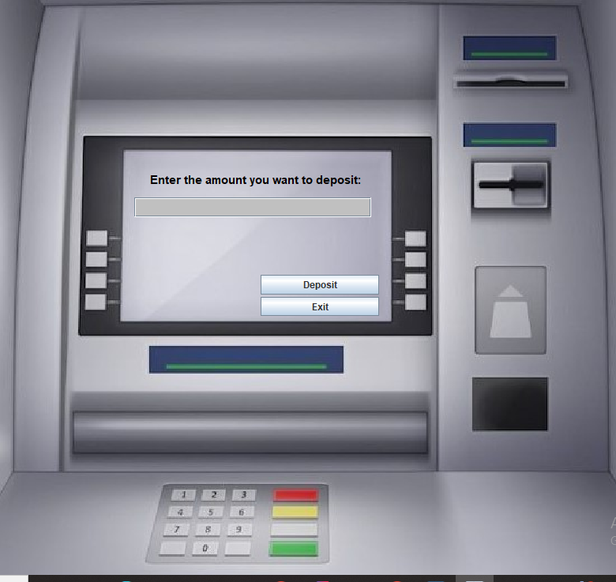
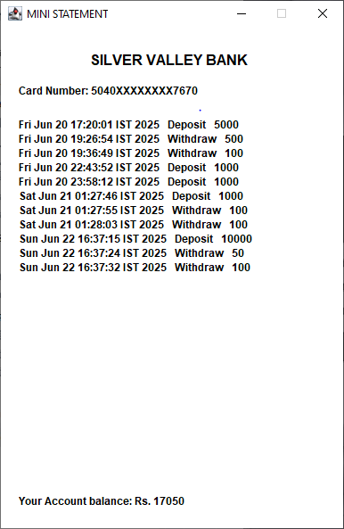
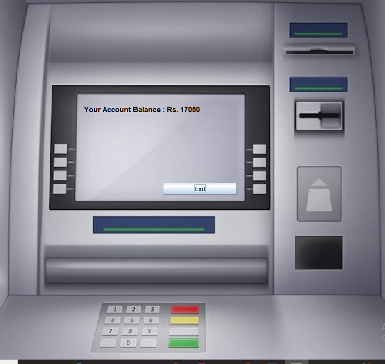
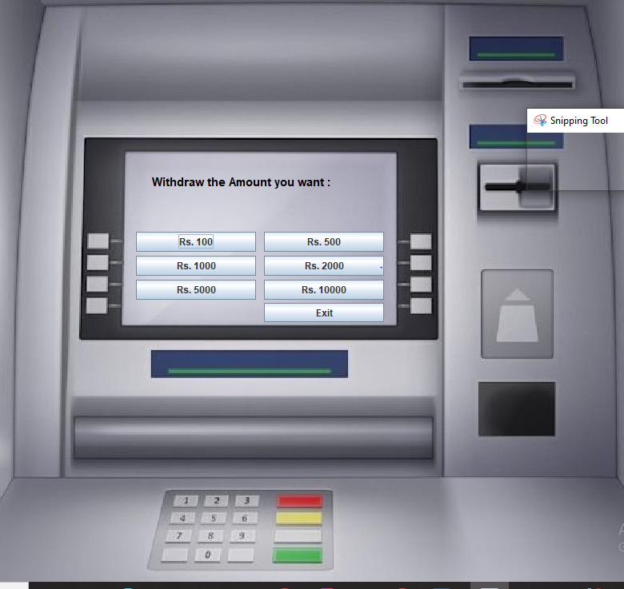
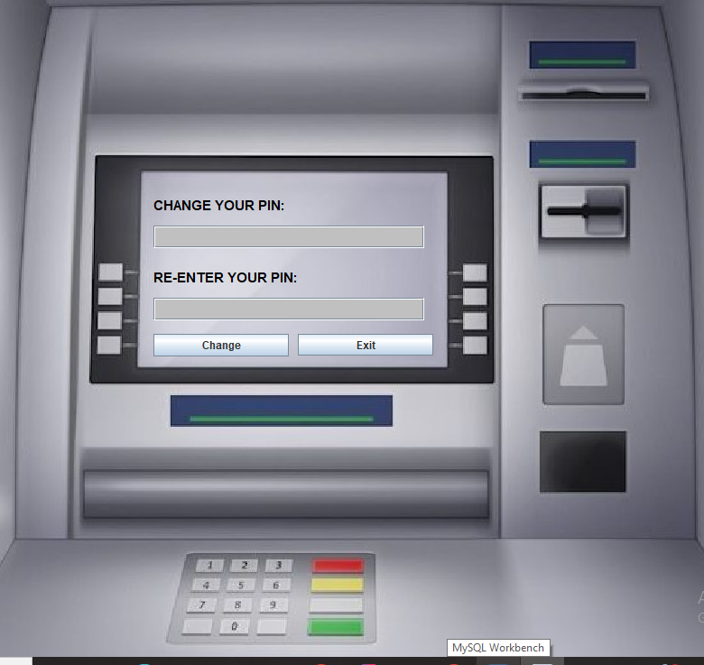
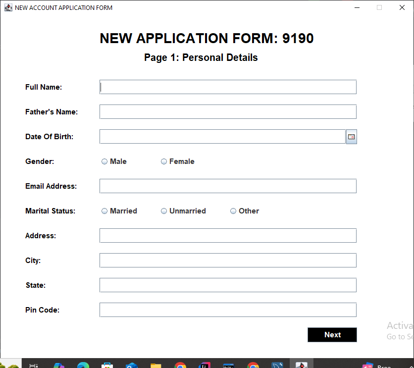
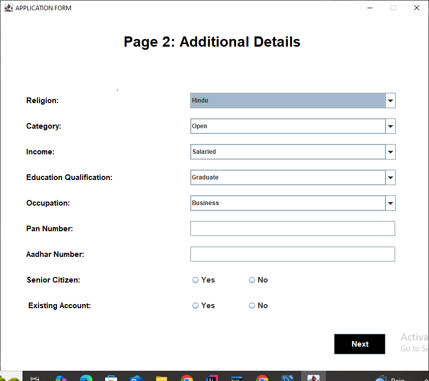
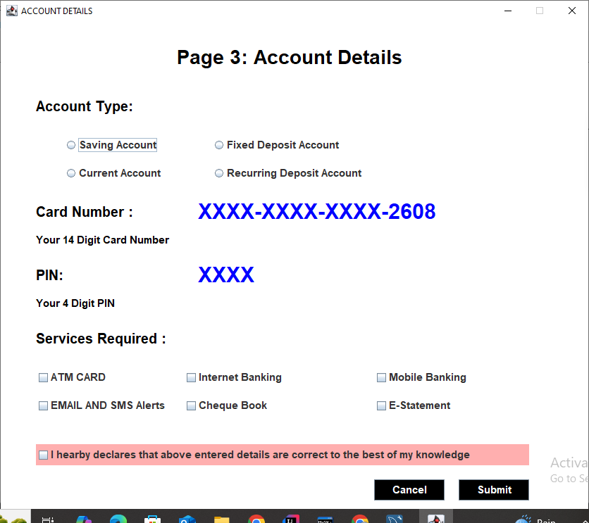

# 💰 Bank Management System
The **Bank Management System** is a comprehensive ATM simulation application built in Java that provides users with essential banking operations.   <br>
This system allows users to create accounts, perform transactions, and manage their banking activities through an intuitive graphical user interface.

## ✨ Features

### 🔐 Authentication
- **Login System**: Secure user authentication
- **Sign Up Process**: Three-step registration process
- **Account Verification**: Comprehensive user data collection

### 💰 Transaction Operations
- **💳 Deposit**: Add money to your account
- **💸 Withdrawal**: Withdraw money from your account
- **📄 Mini Statement**: View recent transaction history
- **💰 Balance Enquiry**: Check current account balance
- **⚡ Fast Cash**: Quick withdrawal with preset amounts
- **🔢 Change PIN**: Update your account PIN for security

## 🏗️ System Architecture

```
Bank Management System
│
├── 🖥️ GUI Layer (Java Swing)
│   ├── Main.java (Entry Point)
│   ├── Login.java → Transaction.java (Existing Users)
│   ├── SignUp.java → SignUpTwo.java → SignUpThree.java → Deposit.java (New Users)
│   └── Transaction Operations:
│       ├── Deposit.java
│       ├── Withdrawal.java
│       ├── MiniStatement.java
│       ├── BalanceEnquiry.java
│       ├── FastCash.java
│       └── ChangePin.java
│
├── 🔄 Database Connection Layer
│   └── Conn.java (Database Connectivity)
│
└── 🗄️ Data Layer (MySQL Database)
    └── bank_management_system DB
        ├── login table
        ├── signUp table
        ├── signUpTwo table  
        ├── signUpThree table
        └── bank table (All Transactions)
```

## 🗃️ Database Schema

### Database: `bank_management_system`

#### Tables Structure: Need to create before starting code writing

1. **🔑 login**
   - Stores user login credentials and authentication data

2. **👤 signUp**
   - First form registration data (personal information)

3. **📋 signUpTwo**
   - Second form registration data (additional details)

4. **🏦 signUpThree**
   - Third form registration data (account preferences)

5. **💼 bank**
   - All transaction records including deposits, withdrawals, and fast cash operations
   - Maintains complete transaction history and account balance tracking

## 🚀 Installation

### Prerequisites
- ☕ Java Development Kit (JDK 8 or higher)
- 🗄️ MySQL Database Server
- 💻 IDE (NetBeans, Eclipse, or IntelliJ IDEA)

### Steps
1. **Clone the repository**
   ```bash
   git clone https://github.com/yourusername/bank_management_system.git
   cd bank_management_system
   ```

2. **Database Setup**
   - Create MySQL database named `bank_management_system`
   - Ensure all required tables are created: login, signUp, signUpTwo, signUpThree, bank

3. **Configure Database Connection**
   - Update database credentials in `Conn.java`
   - Ensure MySQL connector JAR is in classpath

4. **Compile and Run**
   ```bash
   javac -d . src/bank_system/main/*.java src/bank_system/repository/*.java
   java bank_system.main.Main
   ```

## 📱 Usage

### 🆕 New User Journey
1. **Sign Up Process** 📝
   - Complete three-step registration process through signUp, signUpTwo, and signUpThree forms
   - Fill all required personal, contact, and account preference details
   - **Mandatory Initial Deposit** 💳: After completing signup, system redirects to deposit.java

2. **Initial Deposit** 💰
   - New users must make an initial deposit to activate their account
   - Deposit amount gets stored in the bank table
   - Account becomes operational after successful deposit

### 🔄 Existing User Journey
1. **Login** 🔐
   - Enter credentials through Login.java
   - Successful login redirects to Transaction.java main dashboard

2. **Transaction Dashboard** ⚙️
   - Access all banking operations from Transaction.java
   - **💰 Deposit**: Add funds to account
   - **💸 Withdrawal**: Remove funds from account  
   - **📋 Mini Statement**: View recent transaction history
   - **💰 Balance Enquiry**: Check current account balance
   - **⚡ Fast Cash**: Quick preset amount withdrawals
   - **🔢 Change PIN**: Update security PIN
   - All transactions are recorded in the bank table

## 📸 Screenshots
1.Login Page <br>
   <br>
2.Transaction Page  <br>
  <br>
3.Deposit Page  <br>
  <br>
4.MiniStatement  <br>
  <br>
5.Bank Balance Enquiry  <br>
  <br>
6. Fast Cash Page  <br>
   <br>
7.Pin Change Page  <br>
   <br>
8. Three Sign-up Form Page   <br>
   <br>
   <br>
   <br>


## 🛠️ Technologies Used

- **Programming Language**: ☕ Java
- **GUI Framework**: 🖥️ Java Swing
- **Database**: 🗄️ MySQL
- **JDBC**: Database connectivity
- **IDE**: 💻 NetBeans/Eclipse/IntelliJ

## 📁 Project Structure

```
bank_management_system/
│
├── 📂 src/
│   └── 📂 bank_system/
│       ├── 📂 main/
│       │   └── ☕ Main.java
│       └── 📂 repository/
│           ├── 🔗 Conn.java
│           ├── 🔐 Login.java
│           ├── 📝 SignUp.java
│           ├── 📝 SignUpTwo.java
│           ├── 📝 SignUpThree.java
│           ├── 💳 Transaction.java
│           ├── 💰 Deposit.java
│           ├── 💸 Withdrawal.java
│           ├── 📄 MiniStatement.java
│           ├── 💰 BalanceEnquiry.java
│           ├── ⚡ FastCash.java
│           └── 🔢 ChangePin.java
│
├── 📂 lib/
│   └── 🔌 mysql-connector-java.jar
│
└── 📖 README.md
```
---

**⭐ Don't forget to star this repository if you found it helpful!**

**Happy Banking! 🏦💰**
